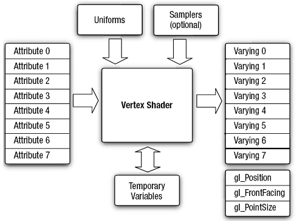
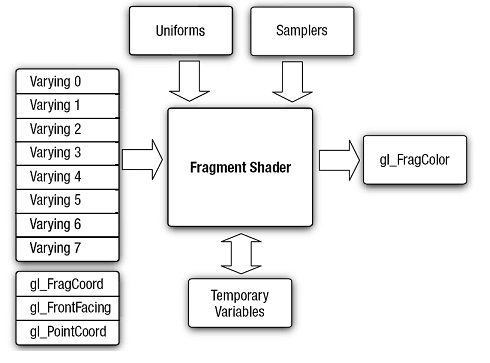
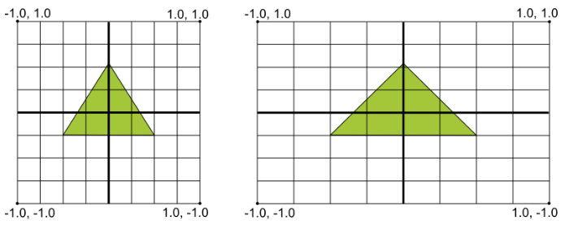
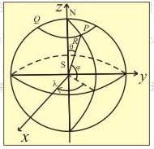
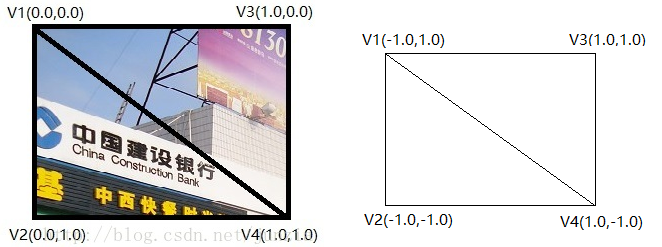
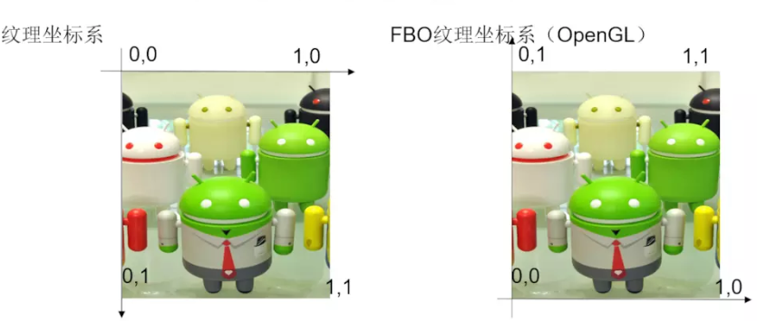
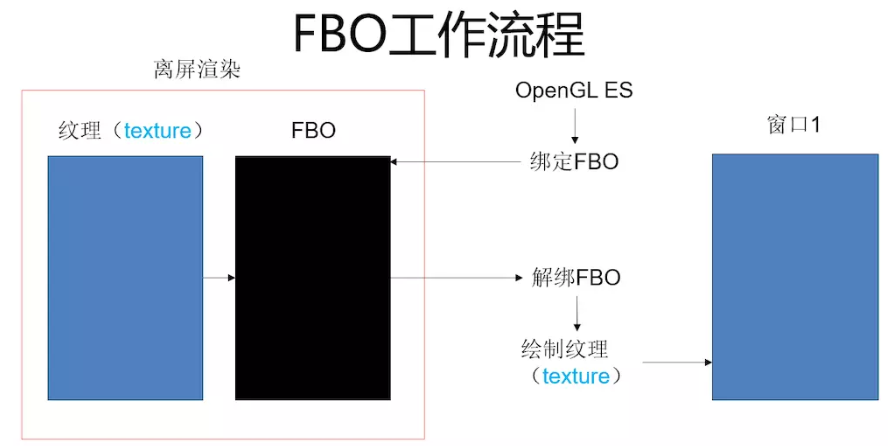

本文主要根据[作者博客](https://blog.csdn.net/junzia/article/details/52793354)以及demo展示，配合文字图片进行相应的解读，纯属笔记。

## render

> 主要绘制三角形，矩形，球等基础形状，可以学习到openglES基本知识。比如varying,uniform attribute等shader限定符基本用法。

### 三角形.

#### 着色器语言

> 着色器（Shader）是在GPU上运行的小程序。从名称可以看出，可通过处理它们来处理顶点。此程序使用OpenGL ES SL语言来编写。它是一个描述顶点或像素特性的简单程序。

##### 顶点着色器

>  对于发送给GPU的每一个顶点，都要执行一次顶点着色器。其功能是把每个顶点在虚拟空间中的三维坐标变换为可以在屏幕上显示的二维坐标，并带有用于z-buffer的深度信息。**顶点着色器可以操作的属性有：位置、颜色、纹理坐标，但是不能创建新的顶点。**



##### 片元着色器

> 片元着色器计算每个像素的颜色和其它属性。**它通过应用光照值、凹凸贴图，阴影，镜面高光，半透明等处理来计算像素的颜色并输出。**它也可改变像素的深度(z-buffering)或在多个渲染目标被激活的状态下输出多种颜色。一个片元着色器不能产生复杂的效果，因为它只在一个像素上进行操作，而不知道场景的几何形状。



代码示例：

```c
private final String vertexShaderCode =
            "attribute vec4 vPosition;" +
                    "uniform mat4 vMatrix;"+
                    "varying  vec4 vColor;"+
                    "attribute vec4 aColor;"+
                    "void main() {" +
                    "  gl_Position = vMatrix*vPosition;" +
                    "  vColor=aColor;"+
                    "}";

    private final String fragmentShaderCode =
            "precision mediump float;" +
                    "varying vec4 vColor;" +
                    "void main() {" +
                    "  gl_FragColor = vColor;" +
                    "}";
```

> Notes: 
>
> gl_position`和`gl_FragColor`属于内置变量，分别为定点位置和片元颜色，不需要声明。
>
> 对于`uniform`限定符一般用于对同一组顶点组成的3D物体中各个顶点都相同的量。比如对一组vertex进行矩阵相同的变换。`attribute`限定符可以用来表示不同的值，比如不同的颜色color。varying限定符 主要用来表示从顶点着色器计算出来传到片元着色器中，当作输入值，因而在顶点着色器中，varying 表示需要赋值的量。

#### 投影

> 如果不设置投影矩阵的话，即使在2D图形种，根据坐标值，往往会根据屏幕长宽比出现畸形。
>
> 投影分为2种，正交投影（**orthoM**），透视投影（**frustumM** ）。



* 使用正交投影，物体呈现出来的大小不会随着其距离视点的远近而发生变化。
* 使用透视投影，物体离视点越远，呈现出来的越小。离视点越近，呈现出来的越大。

##### Matrix.setLookAtM解析

```java
public static void setLookAtM(float[] rm, int rmOffset,
            float eyeX, float eyeY, float eyeZ, // 相机所在的位置，摄像机的位置，即观察者眼睛的位置
            float centerX, float centerY, float centerZ, // 摄像机目标点 center of view
            float upX, float upY,float upZ) // 相机的UP向量
```

改变摄像机顶部的方向很显然会改变相机旋转，这样就会会影响到绘制图像的角度。 (0,1,0)：这是相机正对着目标图像。(1,0,0)：左旋90°。(0,0,1)：镜头向上，看屁。

##### 透视矩阵`frustumM`

```java
public static void frustumM(float[] m, int offset,
            float left, float right, float bottom, float top, // 1
            float near, float far) // 2
```

1. [1] 这4个参数会影响图像左右和上下缩放比，所以往往会设置的值分别`-(float) width / height`和`(float) width / height`，top和bottom和top会影响上下缩放比，如果left和right已经设置好缩放，则bottom只需要设置为-1，top设置为1，这样就能保持图像不变形。也可以将left，right 与bottom，top交换比例，即bottom和top设置为` -height/width 和 height/width`, left和right设置为-1和1。 
2. [2] near和far参数稍抽象一点，就是一个立方体的前面和后面，near和far需要结合拍摄相机即观察者眼睛的位置来设置。例如setLookAtM中设置`cx = 0, cy = 0, cz = 10`，near设置的范围需要是小于10才可以看得到绘制的图像，如果大于10，图像就会处于了观察这眼睛的后面，这样绘制的图像就会消失在镜头前，far参数，far参数影响的是立体图形的背面，**far一定比near大，一般会设置得比较大，如果设置的比较小，一旦3D图形尺寸很大，这时候由于far太小，这个投影矩阵没法容纳图形全部的背面，这样3D图形的背面会有部分隐藏掉的。**

最后：由于三角形绘制较为简单，来个完整代码展示基本写法。

```java
public class TriangleColorFull extends Shape {

    private FloatBuffer vertexBuffer,colorBuffer;
    private final String vertexShaderCode =
            "attribute vec4 vPosition;" +
                    "uniform mat4 vMatrix;"+
                    "varying  vec4 vColor;"+
                    "attribute vec4 aColor;"+
                    "void main() {" +
                    "  gl_Position = vMatrix*vPosition;" +
                    "  vColor=aColor;"+
                    "}";

    private final String fragmentShaderCode =
            "precision mediump float;" +
                    "varying vec4 vColor;" +
                    "void main() {" +
                    "  gl_FragColor = vColor;" +
                    "}";

    private int mProgram;

    static final int COORDS_PER_VERTEX = 3;
    static float triangleCoords[] = {
            0.5f,  0.5f, 0.0f, // top
            -0.5f, -0.5f, 0.0f, // bottom left
            0.5f, -0.5f, 0.0f  // bottom right
    };

    private int mPositionHandle;
    private int mColorHandle;

    private float[] mViewMatrix=new float[16];
    private float[] mProjectMatrix=new float[16];
    private float[] mMVPMatrix=new float[16];

    //顶点个数
    private final int vertexCount = triangleCoords.length / COORDS_PER_VERTEX;
    //顶点之间的偏移量
    private final int vertexStride = COORDS_PER_VERTEX * 4; // 每个顶点四个字节

    private int mMatrixHandler;

    //设置颜色
    float color[] = {
            0.0f, 1.0f, 0.0f, 1.0f ,
            1.0f, 0.0f, 0.0f, 1.0f,
            0.0f, 0.0f, 1.0f, 1.0f
    };

    public TriangleColorFull(View mView) {
        super(mView);
        //ByteBuffer bb = ByteBuffer.allocateDirect(
              //  triangleCoords.length * 4);
        //bb.order(ByteOrder.nativeOrder());
        //vertexBuffer = bb.asFloatBuffer();
        //vertexBuffer.put(triangleCoords);
        //可以改为：
        vertexBuffer=ByteBuffer.allocateDirect(triangleCoords.length*4)
                .order(ByteOrder.nativeOrder())
                .asFloatBuffer().put(triangleCoords);
        vertexBuffer.position(0);

        ByteBuffer dd = ByteBuffer.allocateDirect(
                color.length * 4);
        dd.order(ByteOrder.nativeOrder());
        colorBuffer = dd.asFloatBuffer();
        colorBuffer.put(color);
        colorBuffer.position(0);

        int vertexShader = loadShader(GLES20.GL_VERTEX_SHADER,
                vertexShaderCode);
        int fragmentShader = loadShader(GLES20.GL_FRAGMENT_SHADER,
                fragmentShaderCode);

        //创建一个空的OpenGLES程序
        mProgram = GLES20.glCreateProgram();
        //将顶点着色器加入到程序
        GLES20.glAttachShader(mProgram, vertexShader);
        //将片元着色器加入到程序中
        GLES20.glAttachShader(mProgram, fragmentShader);
        //连接到着色器程序
        GLES20.glLinkProgram(mProgram);
    }

    @Override
    public void onSurfaceCreated(GL10 gl, EGLConfig config) {

    }

    @Override
    public void onSurfaceChanged(GL10 gl, int width, int height) {
        //计算宽高比
        float ratio=(float)width/height;
        //设置透视投影
        Matrix.frustumM(mProjectMatrix, 0, -ratio, ratio, -1, 1, 3, 10);
        //设置相机位置
        Matrix.setLookAtM(mViewMatrix, 0, 0, 0, 5.0f, 0f, 0f, 0f, 0f, 1.0f, 0.0f);
        //计算变换矩阵
        Matrix.multiplyMM(mMVPMatrix,0,mProjectMatrix,0,mViewMatrix,0);
    }

    @Override
    public void onDrawFrame(GL10 gl) {
        GLES20.glClear(GLES20.GL_COLOR_BUFFER_BIT| GLES20.GL_DEPTH_BUFFER_BIT);
        //将程序加入到OpenGLES2.0环境
        GLES20.glUseProgram(mProgram);
        //获取变换矩阵vMatrix成员句柄
        mMatrixHandler= GLES20.glGetUniformLocation(mProgram,"vMatrix");
        //指定vMatrix的值
        GLES20.glUniformMatrix4fv(mMatrixHandler,1,false,mMVPMatrix,0);
        //获取顶点着色器的vPosition成员句柄
        mPositionHandle = GLES20.glGetAttribLocation(mProgram, "vPosition");
        //启用三角形顶点的句柄
        GLES20.glEnableVertexAttribArray(mPositionHandle);
        //准备三角形的坐标数据
        GLES20.glVertexAttribPointer(mPositionHandle, COORDS_PER_VERTEX,
                GLES20.GL_FLOAT, false,
                vertexStride, vertexBuffer);
        //获取片元着色器的vColor成员的句柄
        mColorHandle = GLES20.glGetAttribLocation(mProgram, "aColor");
        //设置绘制三角形的颜色
        GLES20.glEnableVertexAttribArray(mColorHandle);
        GLES20.glVertexAttribPointer(mColorHandle,4,
                GLES20.GL_FLOAT,false,
                0,colorBuffer);
        //绘制三角形
        GLES20.glDrawArrays(GLES20.GL_TRIANGLES, 0, vertexCount);
        //禁止顶点数组的句柄
        GLES20.glDisableVertexAttribArray(mPositionHandle);
    }

}
```
### 圆,正方形,立方体

#### 顶点法 `GLES20.glDrawArrays`

绘制方式如下：
```c
int GL_POINTS       //将传入的顶点坐标作为单独的点绘制
int GL_LINES        //将传入的坐标作为单独线条绘制，ABCDEFG六个顶点，绘制AB、CD、EF三条线
int GL_LINE_STRIP   //将传入的顶点作为折线绘制，ABCD四个顶点，绘制AB、BC、CD三条线
int GL_LINE_LOOP    //将传入的顶点作为闭合折线绘制，ABCD四个顶点，绘制AB、BC、CD、DA四条线。
int GL_TRIANGLES    //将传入的顶点作为单独的三角形绘制，ABCDEF绘制ABC,DEF两个三角形
int GL_TRIANGLE_FAN    //将传入的顶点作为扇面绘制，ABCDEF绘制ABC、ACD、ADE、AEF四个三角形
int GL_TRIANGLE_STRIP   //将传入的顶点作为三角条带绘制，ABCDEF绘制ABC,BCD,CDE,DEF四个三角形
```

* `GL_TRIANGLE_STRIP`
`GL_TRIANGLE_STRIP`的方式绘制连续的三角形，比直接用`GL_TRIANGLES`的方式绘制三角形少好多个顶点，效率会高很多。另外，`GL_TRIANGLE_STRIP`并不是只能绘制连续的三角形构成的物体，我们只需要将不需要重复绘制的点重复两次即可。比如，传入ABCDEEFFGH坐标，就会得到ABC、BCD、CDE以及FGH四个三角形

* `GL_TRIANGLE_FAN`
扇面绘制是以第一个为零点进行绘制，通常我们绘制圆形，圆锥的锥面都会使用到，值得注意的是，最后一个点的左边应当与第二个点重合，在计算的时候，起点角度为0度，终点角度应包含360度。

#### 索引法 `GLES20.glDrawElements`
```java
static float triangleCoords[] = {
            -0.5f,  0.5f, 0.0f, // top left
            -0.5f, -0.5f, 0.0f, // bottom left
            0.5f, -0.5f, 0.0f, // bottom right
            0.5f,  0.5f, 0.0f,  // top right
    };

static short index[]={
    0,1,2,0,2,3
};

//绘制三角形
GLES20.glDrawArrays(GLES20.GL_TRIANGLE_FAN, 0, vertexCount);
//索引法绘制正方形
GLES20.glDrawElements(GLES20.GL_TRIANGLES,index.length, GLES20.GL_UNSIGNED_SHORT,indexBuffer);
```
其实上述两种方法是等效的！

> 顶点法拥有的绘制方式，索引法也都有。相对于顶点法在复杂图形的绘制中无法避免大量顶点重复的情况，索引法可以相对顶点法减少很多重复顶点占用的空间。

#### 立方体绘制

有了正方形的绘制，利用索引法。一个立方体6个面，8个顶点。

```java
final float cubePositions[] = {
            -1.0f,1.0f,1.0f,    //正面左上0
            -1.0f,-1.0f,1.0f,   //正面左下1
            1.0f,-1.0f,1.0f,    //正面右下2
            1.0f,1.0f,1.0f,     //正面右上3
            -1.0f,1.0f,-1.0f,    //反面左上4
            -1.0f,-1.0f,-1.0f,   //反面左下5
            1.0f,-1.0f,-1.0f,    //反面右下6
            1.0f,1.0f,-1.0f,     //反面右上7
    };

    final short index[]={
            0,3,2,0,2,1,    //正面
            0,1,5,0,5,4,    //左面
            0,7,3,0,4,7,    //上面
            6,7,4,6,4,5,    //后面
            6,3,7,6,2,3,    //右面
            6,5,1,6,1,2     //下面
    };
```
* **需要开启深度测试**

`使用 glEnable(GL_DEPTH_TEST);`

#### 绘制圆锥,圆柱和球

* 圆锥

圆锥我们很容易就能想到把它拆解成一个圆形和一个锥面，锥面的顶点与圆形的顶点，除了锥面的中心点的坐标有了“高度”，其他的完全相同。

```java
ArrayList<Float> pos=new ArrayList<>();
pos.add(0.0f);
pos.add(0.0f);
pos.add(height);        //给圆心相对圆边增加高度，使之形成锥面
float angDegSpan=360f/n;
for(float i=0;i<360+angDegSpan;i+=angDegSpan){
    pos.add((float) (radius*Math.sin(i*Math.PI/180f)));
    pos.add((float)(radius*Math.cos(i*Math.PI/180f)));
    pos.add(0.0f);
}
```
* 圆柱

圆柱的与圆锥类似，我们可以把圆柱拆解成上下两个圆面，加上一个圆筒。圆筒我们之前也没画过，它怎么拆解成三角形呢？我们可以如同拆圆的思路来理解圆柱，想想正三菱柱、正八菱柱、正一百菱柱……菱越多，就越圆滑与圆柱越接近了，然后再把每个菱面（矩形）拆解成两个三角形就OK了，拆解的顶点为：

```java
ArrayList<Float> pos=new ArrayList<>();
        float angDegSpan=360f/n;
        for(float i=0;i<360+angDegSpan;i+=angDegSpan){
            pos.add((float) (radius*Math.sin(i*Math.PI/180f)));
            pos.add((float)(radius*Math.cos(i*Math.PI/180f)));
            pos.add(height);
            pos.add((float) (radius*Math.sin(i*Math.PI/180f)));
            pos.add((float)(radius*Math.cos(i*Math.PI/180f)));
            pos.add(0.0f);
        }
```
* 球

相对于圆锥圆柱来说，球体的拆解就复杂了许多，比较常见的拆解方法是将按照经纬度拆解和按照正多面体拆解。

$( R * cos(ψ) * sin(λ),R * sin(ψ),R * cos(ψ) * cos(λ))$



```java
//球以(0,0,0)为中心，以R为半径，则球上任意一点的坐标为
        // ( R * cos(a) * sin(b),y0 = R * sin(a),R * cos(a) * cos(b))
        // 其中，a为圆心到点的线段与xz平面的夹角，b为圆心到点的线段在xz平面的投影与z轴的夹角
        ArrayList<Float> data=new ArrayList<>();
        float r1,r2;
        float h1,h2;
        float sin,cos;
        for(float i=-90;i<90+step;i+=step){
            r1 = (float)Math.cos(i * Math.PI / 180.0);
            r2 = (float)Math.cos((i + step) * Math.PI / 180.0);
            h1 = (float)Math.sin(i * Math.PI / 180.0);
            h2 = (float)Math.sin((i + step) * Math.PI / 180.0);
            // 固定纬度, 360 度旋转遍历一条纬线
            float step2=step*2;
            for (float j = 0.0f; j <360.0f+step; j +=step2 ) {
                cos = (float) Math.cos(j * Math.PI / 180.0);
                sin = -(float) Math.sin(j * Math.PI / 180.0);

                data.add(r2 * cos);
                data.add(h2);
                data.add(r2 * sin);
                data.add(r1 * cos);
                data.add(h1);
                data.add(r1 * sin);
            }
```

## 着色器语言语法
[着色器语言语法介绍](https://blog.csdn.net/junzia/article/details/52830604)

## 纹理贴图

### 纹理贴图坐标系



左图为纹理图和纹理坐标，右图为顶点图和顶点坐标。 
将纹理映射到右边的两个三角形上（也就是一个矩形），需要将纹理坐标指定到正确的顶点上，才能使纹理正确的显示，否则显示出来的纹理会无法显示，或者出现旋转、翻转、错位等情况。 
将右图顶点按照`V2 V1 V4 V3`传入，以三角形条带方式绘制，则纹理坐标应按照`V2 V1 V4 V3`传入。如果按照`V3 V4 V1 V2`传入，会得到一个旋转了180度的纹理。如果按照`V4 V3 V2 V1`传入，则会得到一个左右翻转的纹理。

```java
attribute vec4 vPosition;
attribute vec2 vCoordinate;
uniform mat4 vMatrix;

varying vec2 aCoordinate;

void main(){
    gl_Position=vMatrix*vPosition;
    aCoordinate=vCoordinate;
}
```
可以看到，顶点着色器中增加了一个vec2变量，并将这个变量传递给了片元着色器，这个变量就是纹理坐标。接着我们修改片元着色器为：
```java
//修改片元着色器
precision mediump float;

uniform sampler2D vTexture;
varying vec2 aCoordinate;

void main(){
    gl_FragColor=texture2D(vTexture,aCoordinate);
}
```
片元着色器中，增加了一个`sampler2D`的变量，`sampler2D`是GLSL的变量类型之一的取样器。`texture2D`是GLSL的**内置函数**，用于2D纹理取样，根据纹理取样器和纹理坐标，可以得到当前纹理取样得到的像素颜色。

```java
private int createTexture(){
    int[] texture=new int[1];
    if(mBitmap!=null&&!mBitmap.isRecycled()){
        //生成纹理
        GLES20.glGenTextures(1,texture,0);
        //生成纹理
        GLES20.glBindTexture(GLES20.GL_TEXTURE_2D,texture[0]);
        //设置缩小过滤为使用纹理中坐标最接近的一个像素的颜色作为需要绘制的像素颜色
        GLES20.glTexParameterf(GLES20.GL_TEXTURE_2D, GLES20.GL_TEXTURE_MIN_FILTER,GLES20.GL_NEAREST);
        //设置放大过滤为使用纹理中坐标最接近的若干个颜色，通过加权平均算法得到需要绘制的像素颜色
        GLES20.glTexParameterf(GLES20.GL_TEXTURE_2D,GLES20.GL_TEXTURE_MAG_FILTER,GLES20.GL_LINEAR);
        //设置环绕方向S，截取纹理坐标到[1/2n,1-1/2n]。将导致永远不会与border融合
        GLES20.glTexParameterf(GLES20.GL_TEXTURE_2D, GLES20.GL_TEXTURE_WRAP_S,GLES20.GL_CLAMP_TO_EDGE);
        //设置环绕方向T，截取纹理坐标到[1/2n,1-1/2n]。将导致永远不会与border融合
        GLES20.glTexParameterf(GLES20.GL_TEXTURE_2D, GLES20.GL_TEXTURE_WRAP_T,GLES20.GL_CLAMP_TO_EDGE);
        //根据以上指定的参数，生成一个2D纹理
        GLUtils.texImage2D(GLES20.GL_TEXTURE_2D, 0, mBitmap, 0);
        return texture[0];
    }
    return 0;
}
```

## OpenGLES帧缓冲(FBO)

[OpenGLES帧缓冲(FBO)](https://www.jianshu.com/p/78a64b8fb315)



